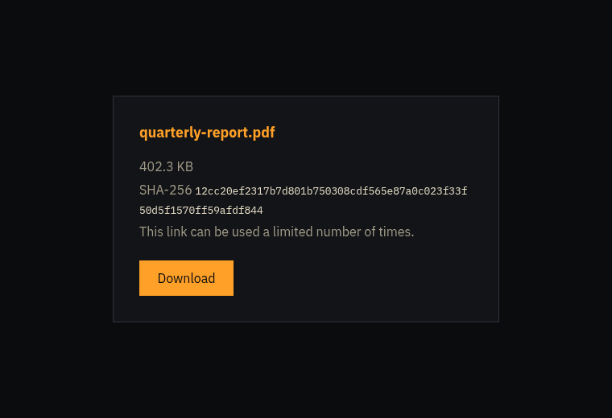
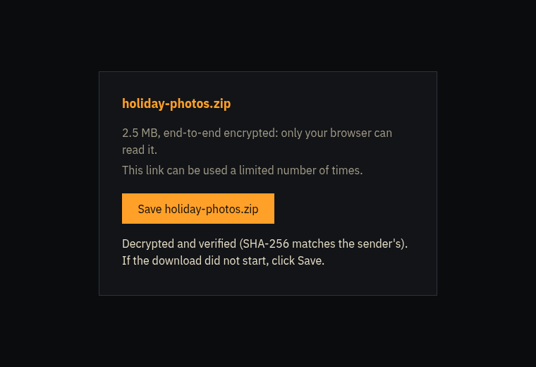
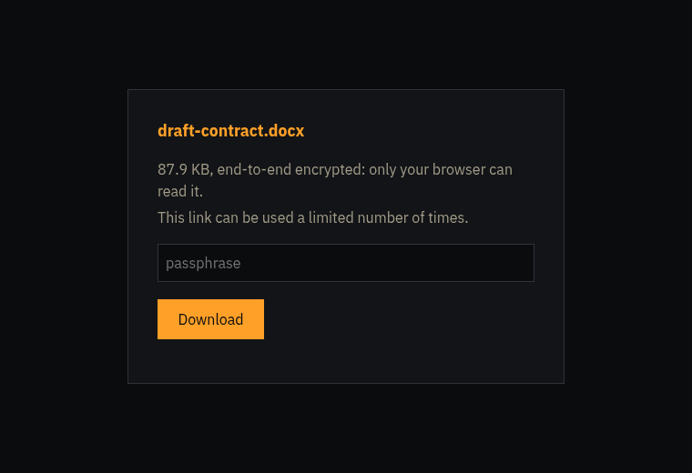
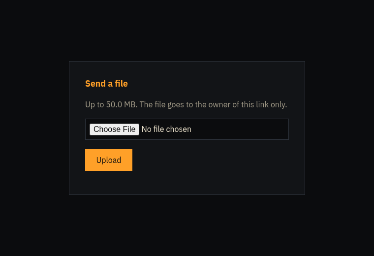
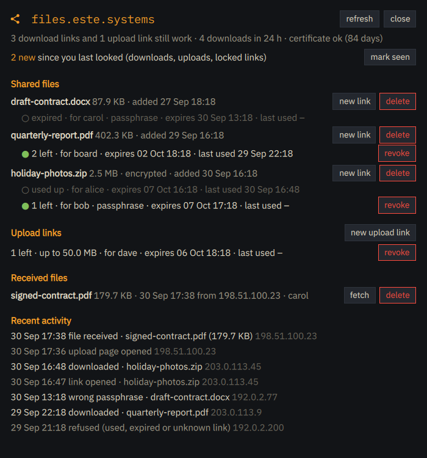

# drop

One-time file links for a small self-hosted server, behind nginx and Cloudflare. Built for sharing
files with a few people: no accounts, no SSO, just a link that works once (or N times) and expires.

- **drop** (server, `/usr/bin/drop`): stores files, issues links, serves the pages; nginx sends the
  bytes. Tokens are 256-bit and stored only as SHA-256.
- **share** (laptop, `/usr/bin/share`): uploads over ssh, prints links, manages them, fetches uploads,
  and runs `share watch` for desktop notifications and status-bar data.

## Screenshots

A plain link and an end-to-end encrypted one (the page decrypts in the browser and checks the sender's SHA-256):

<p>


</p>

A link with a passphrase, and a one-time upload link:

<p>


</p>

`share panel` on the laptop (demo data), opened from the status bar module :



## Links

| Link | What happens |
|---|---|
| `https://…/d/<token>` | a page with the file name/size (or "Encrypted file") and a Download button. Only the button (POST) uses the link, so chat-app previews cannot burn it |
| `https://…/d/<token>#k=…&n=…&h=…` | end-to-end encrypted file (default for `share add`): the key, name and SHA-256 are in the fragment, which browsers never send; the page decrypts with WebCrypto and verifies the checksum. The server only has ciphertext. After decrypting, the page shows a Save button (iOS Safari only saves on a direct tap) and, where supported, the share sheet (Save to Files/Photos) |
| `https://…/u/<token>` | one-time **upload** link: someone sends you a file (up to 95 MB by default, Cloudflare's free plan caps request bodies at 100 MB); it lands in the inbox |

Per link: `--uses N` (default 1), `--ttl 7d`, `--note NAME`, `--pass` (a generated passphrase to send
by another channel; five wrong attempts lock the link). After a download, the same IP may retry for
15 minutes (broken connections), without using another use.

## Usage

```
share add FILE --note alice                      # encrypted upload, one link for one download, 7 days
share add FILE --plain --uses 3 --ttl 2d --qr    # plain file, 3 downloads, 2 days, QR code
share link FILE_ID --note bob --pass             # a second person's link, with a passphrase
share request --note carol --max-size 20M        # carol can send you one file up to 20 MB
share fetch INBOX_ID ~/Downloads/                # download what carol sent, sha256 verified
```

## share reference (laptop)

Options for every link-creating command (`add`, `link`, `request`):

| Option | Default | Meaning |
|---|---|---|
| `--uses N` | 1 | how many times the link works (downloads, or files for an upload link) |
| `--ttl T` | `7d` | lifetime: a number with `m` (minutes), `h`, `d` or `w`, e.g. `30m`, `12h`, `7d`, `2w` |
| `--note TEXT` | none | who it is for; shown in `list`, `log` and notifications |
| `--pass` | off | also require a generated passphrase (`xxxx-xxxx-xxxx`) that is printed once; send it by another channel. Five wrong attempts lock the link |
| `--qr` | off | also print the link as a QR code in the terminal (needs `qrencode`) |

| Command | Arguments and options | What it does |
|---|---|---|
| `share add FILE` | link options, `--plain` | upload FILE and print its first link. End-to-end encrypted unless `--plain`; encrypted files are limited to 1 GB (browser memory) |
| `share link FILE_ID` | link options | another link to an uploaded file, typically one per person. For encrypted files it needs the key from `~/.local/share/share/keys.json` |
| `share request` | link options, `--max-size SIZE` (default `95M`; `500K`, `50M`, `1G`) | a one-time upload link; received files land in the inbox. Behind Cloudflare's free plan, bodies over 100 MB are rejected |
| `share list` | | files with their links (id, state, expiry, last use, note) and upload links |
| `share log` | `-n N` (default 20) | recent views, downloads, retries, uploads and refusals, with IP |
| `share inbox` | | received files |
| `share fetch ID [DEST]` | DEST: file or directory, default `~/Downloads` | download a received file and verify its SHA-256 |
| `share inbox-rm ID` | | delete a received file on the server |
| `share revoke LINK_ID...` | or `--file FILE_ID` | disable links (at least 6 characters of the id from `share list`), or every link of a file |
| `share rm FILE_ID` | | delete a file, its links and its local key |
| `share status` | | server version, certificate days left, counts, last event |
| `share watch` | `--once` | poll every 60 s: notifications and bar data (run by `share-watch.service`) |
| `share bar` | | one status line for polybar or Quickshell, from the watcher's cache |
| `share seen` | | clear the new-activity counter shown by `share bar` |
| `share panel` | | open or close the panel (a Quickshell window): links with state, recipient, expiry and last use; upload links; received files; recent activity; buttons to revoke, delete, fetch, make a new link or upload link (copied to the clipboard) and mark activity seen. Escape closes it |

Environment: `SHARE_HOST` (ssh host, default `whisper`), `SHARE_POLL` (seconds, default 60).

## drop reference (server, run with sudo)

`share` calls these over ssh; they can also be used directly on the server.

| Command | Arguments and options | What it does |
|---|---|---|
| `drop add FILE` | link options, `--name NAME` (store under this name), `--encrypted` (the file is client-side encrypted), `--json` | store a file and print its first link |
| `drop link FILE_ID` | link options, `--json` | another link to a stored file |
| `drop request` | link options, `--max-size SIZE` (default `95M`), `--json` | one-time upload link |
| `drop list` / `drop inbox` / `drop status` | `--json` | files and links / received files / status |
| `drop log` | `-n N` (default 20) | recent events |
| `drop events` | `--since ID`, `--json` | events after an id (used by `share watch`) |
| `drop revoke LINK_ID...` | or `--file FILE_ID` | disable download or upload links |
| `drop rm FILE_ID` / `drop inbox-rm ID` | | delete a file and its links / a received file |
| `drop gc` | `--keep-days N` (default 3), `--events-days N` (default 90) | delete files whose links have all been dead for N days, dead upload links, and old events (run daily by `drop-gc.timer`) |
| `drop serve` | | the web service (`drop.service`) |
| `drop --version` | | |

The link options (`--uses`, `--ttl`, `--note`, `--pass`) mean the same as for `share`.
Environment: `DROP_BASE` (public URL), `DROP_DB`, `DROP_FILES`, `DROP_INBOX`, `DROP_STATIC`,
`DROP_LISTEN` (default `127.0.0.1:8081`), `DROP_CERT`, `DROP_USER`, `DROP_WEB_GROUP`,
`DROP_GRACE` (retry window in seconds, default 900).

`drop-aop status|enforce|relax` manages Cloudflare Authenticated Origin Pulls (see below).

## Server

`drop.service` (user `drop`, sandboxed) on 127.0.0.1:8081; `drop-gc.timer` daily removes files whose
links have all been dead for 3 days, dead upload links, and events older than 90 days. The nginx site
(`/usr/share/drop/nginx-files.este.systems.conf`, installed if absent): access logs keep only the first
6 characters of a token, 5 req/s per visitor, uploads streamed, files served from an internal location.

Cloudflare Authenticated Origin Pulls: nginx always asks for Cloudflare's client certificate and logs
the result (`aop=`). After enabling AOP in Cloudflare, `drop-aop status` should show only SUCCESS;
then `drop-aop enforce` makes nginx refuse anything else (`drop-aop relax` undoes it).

## Build and test

```
python3 tests/test_drop.py        # 15 end-to-end tests against a real server on a free port
dpkg-buildpackage -us -uc -b      # drop_*.deb (server) and drop-share_*.deb (laptop); runs the tests
```

MIT licensed.
